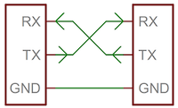
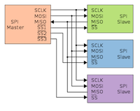
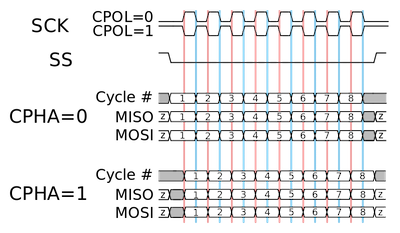
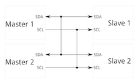

# Notes APP1 S5

## Compilation
1. Pre-Processing
    * Replace `#define` instructions in the code
    * Erase comments
    * Simple grammar check
    * Convert `C++` code to `C`
2. Compilation
    * Convert code to machine code
    * Create the [symbol table](https://en.wikipedia.org/wiki/Symbol_table)
    * Generate the `.o` files
3. Linker
    * Defines location of `ROM` / `RAM` / `FLASH` in system memory
    * Links code to imported `DLLs` or libraries
4. Final Binary Executable
    * Executable binary file

## Memory
### RAM
* Heap
    * Local dynamic variables (ex: `Object x = new Object()`)
* Stack
    * Local initialized variables (ex: `int x = 10`)
* Initialized Global Variables
* Non-Initialized Global Variables

### Flash
* Program code
    * Includes constants (ex: `const int x = 10`)
* Initialized Global Variables
    * These are then copied into `RAM`

### ROM
* Bootloader

## Communication Protocols
### UART
* Physical Config:  
  
RX = Receive  
TX = Transmit

* [Asynchronous](#asynchronous)
* [Full-Duplex](#full-duplex)
* Data Frame:
    * Idle at 1
    * Start bit (0)
    * Data bits (5-9)
    * Parity (Optional)
    * Stop bit (1)
* Slow communication

### SPI
* Physical Config:  
  
SCLK = Signal Clock  
MOSI = Master Output Slave Input  
MISO = Master Input Slave Output  
SS = Chip Select

* [Synchronous](#synchronous)
* [Full-Duplex](#full-duplex)
* Configuration:  

### I2C
* Physical Config:  
  
SCL = Signal Clock  
SDA = Data

* [Synchronous](#synchronous)
* [Half-Duplex](#half-duplex)
* Start bit, device address, acknowledge, stop bit, etc

### CAN
* Network protocol used in vehicles
* Voltage differential between two cables determines bit value
* [Bit Stuffing](#bit-stuffing)

## Definitions
### Full-Duplex
Simultaneous two-way communication

### Half-Duplex
Two-way communication where each party needs to wait for the other to finish

### Simplex
One-way communication

### Asynchronous
Data not controlled by clock signal

### Synchronous
Data controlled by clock signal

### Bit Stuffing
To ensure enough transitions to maintain synchronization, a bit of opposite polarity is inserted after five consecutive bits of the same polarity